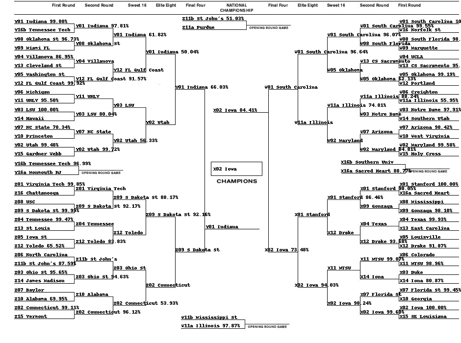

<h1>March Madness Machine Learning 🏀</h1>

<h3>Overview</h3>
The following codebase predicts matchups between NCAA men's
and women's basketball teams, using logistic regression
trained on historical game data.

The results of the algorithm's output for each matchup are
used to solve both the men's and women's NCAA
tournament bracket.

The solution CSV files are compliant with Kaggle's
[March Machine Learning Mania](https://www.kaggle.com/competitions/march-machine-learning-mania-2023/overview)
challenge.

<h3>Tools Used</h3>
- `sqlite`  

- `pandas`  

- `scikit-learn`  

- `bracketeer`  

<h3>Running the Model</h3>
First, install all Python requirements: `pip3 install -r requirements.txt` .
Next, visit the Kaggle [March Machine Learning Mania](https://www.kaggle.com/competitions/march-machine-learning-mania-2023/overview)
page to download the provided test/training data.

Add these files to a directory titled `march-machine-learning-mania-2023` in the root
directory of the project.

From here, configure the `run_config.json` file as desired:

```JSON
{
  "sport": "women",
  "execution_name": "V1",
  "add_external_sources": false,
  "run_data_setup": false,
  "aggregate_team_data": false,
  "transform_and_test": false,
  "export_content": true
}
```

The configuration options are described below:

`sport`: defines the context for the model (`men` or `women`) - it will use the corresponding data as specified here

`execution_name`: name given to your execution, allowing for multiple executions of different names

`add_external_sources`: use the external data in the `external_sources` directory for the model

`run_data_setup`: create/set up the SQLite database (this can be skipped if you've already run this step and your data has not changed)

`aggregate_team_data`: this will likely remain `true` unless previously run - aggregates season data for each team to provide
season average stats

`transform_and_test`: create transformed data from the raw stats to be used in training, testing and predictions
by the model

`export_content`: export the results to CSV and use bracketeer to create an image of bracket predictions

Once configured, run the model: `python3 main.py`

<h3>Women's Bracket 2023 Using Bracketeer:</h3>

